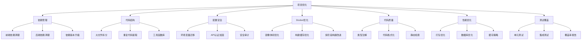
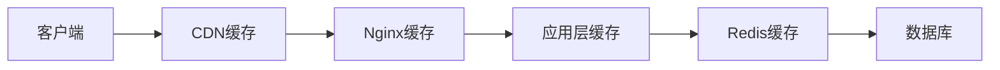

# 项目优化设计文档

## 概述

本文档详细描述了阅影·log 项目优化的技术设计方案。优化工作将分为七个主要模块，每个模块都有明确的目标、实施策略和验收标准。

## 架构

### 优化架构图



## 模块设计

### 1. 依赖管理优化

#### 1.1 前端依赖分析与清理

**问题识别：**
- `framer-motion` (11.0.3) - 未在代码中使用，可以移除
- `react-markdown` (10.1.0) - 需要确认使用情况
- `date-fns` (3.3.1) - 需要确认使用情况

**清理策略：**
1. 使用静态分析工具扫描所有 `.ts` 和 `.tsx` 文件
2. 对于每个依赖，搜索其 import 语句
3. 如果依赖未被使用，从 `package.json` 中移除
4. 运行测试确保功能正常

**依赖升级计划：**
- Next.js: 14.1.0 → 15.x（需要评估破坏性变更）
- React: 18.2.0 → 18.3.x（小版本升级）
- @tanstack/react-query: 5.17.19 → 5.x 最新版

#### 1.2 后端依赖分析与清理

**问题识别：**
- 开发依赖混在生产依赖中（pytest, black, isort 等）
- 需要将开发依赖分离到 `requirements-dev.txt`

**清理策略：**
1. 创建 `requirements-dev.txt` 文件
2. 将测试和开发工具依赖移至开发文件
3. 更新 Dockerfile 以区分生产和开发依赖
4. 扫描代码确认所有依赖都被使用

**依赖升级计划：**
- FastAPI: 0.109.0 → 0.115.x（最新稳定版）
- SQLAlchemy: 2.0.25 → 2.0.x 最新版
- Pydantic: 2.5.3 → 2.x 最新版

### 2. 代码结构重构

#### 2.1 超大文件拆分方案

**识别的超大文件：**

| 文件 | 行数 | 问题 | 拆分方案 |
|------|------|------|----------|
| `backend/app/core/cache.py` | 1385 | 包含多个缓存策略和装饰器 | 拆分为 `cache_manager.py`, `cache_decorators.py`, `cache_strategies.py` |
| `backend/app/services/user_item_service.py` | 655 | 包含 CRUD 和复杂业务逻辑 | 拆分为 `user_item_crud.py`, `user_item_business.py` |
| `backend/app/api/routes/user_items.py` | 582 | 包含过多路由处理器 | 按功能拆分为 `user_items_crud.py`, `user_items_query.py` |
| `frontend/app/library/[id]/page.tsx` | 567 | 包含详情页所有逻辑 | 提取组件到 `components/library/detail/` |
| `frontend/components/admin/LLMConfigForm.tsx` | 558 | 表单逻辑过于复杂 | 拆分为多个子表单组件 |

**拆分原则：**
1. **单一职责**：每个文件只负责一个明确的功能
2. **高内聚低耦合**：相关功能放在一起，减少跨文件依赖
3. **可测试性**：拆分后的模块应该易于单独测试
4. **向后兼容**：保持公共 API 不变，只重构内部实现

**示例：cache.py 拆分方案**

```
backend/app/core/cache/
├── __init__.py           # 导出公共接口
├── manager.py            # CacheManager 类
├── decorators.py         # 缓存装饰器
├── strategies.py         # 缓存策略（LRU, TTL等）
├── key_generator.py      # 键生成器
└── invalidation.py       # 缓存失效逻辑
```

#### 2.2 重复代码识别与提取

**重复模式识别：**

1. **API 错误处理模式**
   - 位置：多个路由文件中
   - 重复次数：50+ 次
   - 解决方案：创建 `app/utils/error_handlers.py`

2. **数据库查询过滤模式**
   - 位置：多个 service 文件中
   - 重复次数：30+ 次
   - 解决方案：创建 `app/utils/query_builders.py`

3. **前端数据获取模式**
   - 位置：多个页面组件中
   - 重复次数：20+ 次
   - 解决方案：创建自定义 Hooks `hooks/use-data-fetching.ts`

**提取策略：**
```typescript
// 示例：提取前端数据获取逻辑
// Before: 在每个组件中重复
const [data, setData] = useState(null);
const [loading, setLoading] = useState(true);
const [error, setError] = useState(null);

useEffect(() => {
  fetchData().then(setData).catch(setError).finally(() => setLoading(false));
}, []);

// After: 使用自定义 Hook
const { data, loading, error } = useDataFetch(fetchData);
```

#### 2.3 工具函数库设计

**前端工具库结构：**
```
frontend/lib/utils/
├── api-helpers.ts        # API 调用辅助函数
├── date-formatters.ts    # 日期格式化
├── validators.ts         # 数据验证
├── transformers.ts       # 数据转换
└── error-handlers.ts     # 错误处理
```

**后端工具库结构：**
```
backend/app/utils/
├── query_builders.py     # 查询构建器
├── error_handlers.py     # 错误处理
├── validators.py         # 数据验证
├── transformers.py       # 数据转换
└── decorators.py         # 通用装饰器
```

### 3. 配置与安全加固

#### 3.1 硬编码值迁移

**识别的硬编码问题：**

| 位置 | 硬编码值 | 迁移方案 |
|------|----------|----------|
| `docker-compose.yml` | `http://localhost:3000` | 使用 `${FRONTEND_URL}` |
| `frontend/hooks/use-log-websocket.ts` | `http://localhost:8000` | 使用 `process.env.NEXT_PUBLIC_API_URL` |
| `backend/app/main.py` | `http://localhost:8000/docs` | 使用 `settings.API_URL` |

**迁移步骤：**
1. 在 `.env.example` 中添加新的环境变量
2. 更新代码以使用环境变量
3. 更新文档说明新的环境变量
4. 验证所有环境（开发、测试、生产）都能正常工作

#### 3.2 API 认证加固

**安全审计发现：**

所有路由都已正确使用 `get_current_user` 依赖，无需额外加固。但需要确认以下公开端点：
- `/health` - 健康检查（应保持公开）
- `/api/auth/login` - 登录（应保持公开）
- `/api/auth/register` - 注册（应保持公开）
- `/docs` - API 文档（建议在生产环境中保护）

**加固方案：**
1. 为 API 文档添加可选的基本认证
2. 添加速率限制中间件防止暴力破解
3. 实施 IP 白名单（可选，用于管理端点）

#### 3.3 环境变量管理改进

**当前问题：**
- `.env` 文件包含敏感信息但未在 `.gitignore` 中
- 缺少环境变量验证机制

**改进方案：**
1. 确保 `.env` 在 `.gitignore` 中
2. 创建 `scripts/validate-env.sh` 脚本验证必需的环境变量
3. 在应用启动时验证关键环境变量
4. 为每个环境变量添加详细的文档说明

### 4. Docker 镜像优化

#### 4.1 前端镜像优化

**当前镜像分析：**
- 基础镜像：`node:20-alpine`（约 180MB）
- 构建产物：`.next` 目录（约 200MB）
- 总镜像大小：约 400MB

**优化策略：**

1. **使用 Next.js Standalone 输出**
```javascript
// next.config.js
module.exports = {
  output: 'standalone',
  // 这将只包含必要的文件
}
```

2. **优化依赖安装**
```dockerfile
# 使用 --production 标志
RUN pnpm install --prod --frozen-lockfile
```

3. **移除不必要的文件**
```dockerfile
# 只复制必要的文件
COPY --from=builder /app/.next/standalone ./
COPY --from=builder /app/.next/static ./.next/static
COPY --from=builder /app/public ./public
```

**预期效果：**
- 镜像大小：约 150MB（减少 62.5%）
- 构建时间：减少 30%

#### 4.2 后端镜像优化

**当前镜像分析：**
- 基础镜像：`python:3.11-slim`（约 130MB）
- Python 包：约 800MB
- 总镜像大小：约 950MB

**优化策略：**

1. **分离开发和生产依赖**
```dockerfile
# 生产环境只安装必要的包
COPY requirements.txt ./
RUN pip install --no-cache-dir -r requirements.txt
```

2. **使用 Alpine 基础镜像**
```dockerfile
FROM python:3.11-alpine as base
# 需要安装编译依赖
RUN apk add --no-cache gcc musl-dev libpq-dev
```

3. **清理构建缓存**
```dockerfile
RUN pip install --no-cache-dir -r requirements.txt \
    && rm -rf /root/.cache/pip
```

**预期效果：**
- 镜像大小：约 400MB（减少 58%）
- 启动时间：减少 20%

#### 4.3 构建缓存优化

**优化层顺序：**
```dockerfile
# 1. 先复制依赖文件（变化频率低）
COPY package.json pnpm-lock.yaml ./
RUN pnpm install

# 2. 再复制源代码（变化频率高）
COPY . .
RUN pnpm build
```

**使用 BuildKit 缓存挂载：**
```dockerfile
RUN --mount=type=cache,target=/root/.cache/pip \
    pip install -r requirements.txt
```

### 5. 代码质量提升

#### 5.1 类型系统加强

**前端 TypeScript 配置：**
```json
{
  "compilerOptions": {
    "strict": true,
    "noImplicitAny": true,
    "strictNullChecks": true,
    "strictFunctionTypes": true,
    "noUnusedLocals": true,
    "noUnusedParameters": true
  }
}
```

**后端类型注解规范：**
```python
# 所有函数都应有类型注解
def process_data(
    data: Dict[str, Any],
    user_id: int,
    options: Optional[ProcessOptions] = None
) -> ProcessResult:
    ...
```

#### 5.2 代码格式化与检查

**前端工具链：**
- ESLint：静态代码分析
- Prettier：代码格式化
- TypeScript：类型检查

**后端工具链：**
- Black：代码格式化
- isort：导入排序
- Flake8：代码检查
- mypy：类型检查

**CI/CD 集成：**
```yaml
# .github/workflows/code-quality.yml
- name: Run linters
  run: |
    npm run lint
    npm run type-check
    cd backend && black --check . && flake8 .
```

#### 5.3 文档规范

**函数文档模板：**
```python
def complex_function(param1: str, param2: int) -> Dict[str, Any]:
    """
    简短描述函数功能
    
    详细描述函数的行为、副作用和注意事项
    
    Args:
        param1: 参数1的描述
        param2: 参数2的描述
    
    Returns:
        返回值的描述
    
    Raises:
        ValueError: 什么情况下抛出
        
    Examples:
        >>> complex_function("test", 42)
        {'result': 'success'}
    """
```

### 6. 性能优化

#### 6.1 前端打包优化

**分析工具：**
```bash
# 使用 Next.js 内置分析
ANALYZE=true npm run build
```

**优化策略：**

1. **代码分割**
```typescript
// 动态导入大组件
const HeavyComponent = dynamic(() => import('./HeavyComponent'), {
  loading: () => <Skeleton />,
  ssr: false
});
```

2. **Tree Shaking**
```javascript
// 只导入需要的函数
import { debounce } from 'lodash-es';
// 而不是
import _ from 'lodash';
```

3. **图片优化**
```typescript
// 使用 Next.js Image 组件
<Image
  src="/image.jpg"
  width={800}
  height={600}
  loading="lazy"
  placeholder="blur"
/>
```

#### 6.2 后端性能优化

**数据库查询优化：**

1. **添加索引**
```python
# 为常用查询字段添加索引
class UserItem(Base):
    __tablename__ = "user_items"
    
    user_id = Column(Integer, index=True)
    status = Column(String, index=True)
    content_type = Column(String, index=True)
    
    __table_args__ = (
        Index('idx_user_status', 'user_id', 'status'),
        Index('idx_user_type', 'user_id', 'content_type'),
    )
```

2. **使用查询优化**
```python
# 使用 joinedload 避免 N+1 查询
from sqlalchemy.orm import joinedload

items = db.query(UserItem)\
    .options(joinedload(UserItem.item))\
    .filter(UserItem.user_id == user_id)\
    .all()
```

3. **批量操作**
```python
# 使用 bulk_insert_mappings 批量插入
db.bulk_insert_mappings(UserItem, items_data)
db.commit()
```

#### 6.3 缓存策略优化

**多层缓存架构：**



**缓存策略：**

1. **热数据缓存**
   - 用户个人数据：TTL 5分钟
   - 统计数据：TTL 10分钟
   - 外部 API 数据：TTL 1小时

2. **缓存预热**
   - 应用启动时预加载常用数据
   - 定时任务更新热门内容缓存

3. **缓存失效**
   - 数据更新时主动失效相关缓存
   - 使用版本号实现缓存更新

### 7. 测试覆盖率提升

#### 7.1 单元测试策略

**测试金字塔：**
```
       /\
      /E2E\      10%
     /------\
    /  集成  \    20%
   /----------\
  /   单元测试  \  70%
 /--------------\
```

**单元测试重点：**
1. 工具函数（100% 覆盖）
2. 业务逻辑（80% 覆盖）
3. 数据转换（90% 覆盖）

**测试框架：**
- 前端：Vitest + React Testing Library
- 后端：pytest + pytest-asyncio

#### 7.2 集成测试策略

**API 测试：**
```python
# 测试完整的 API 流程
def test_create_user_item_flow(client, auth_headers):
    # 1. 创建记录
    response = client.post(
        "/api/user-items",
        json=item_data,
        headers=auth_headers
    )
    assert response.status_code == 201
    
    # 2. 验证数据
    item_id = response.json()["id"]
    response = client.get(f"/api/user-items/{item_id}", headers=auth_headers)
    assert response.status_code == 200
```

#### 7.3 测试自动化

**CI/CD 集成：**
```yaml
# .github/workflows/test.yml
name: Tests
on: [push, pull_request]

jobs:
  test:
    runs-on: ubuntu-latest
    steps:
      - uses: actions/checkout@v2
      - name: Run tests
        run: |
          npm test -- --coverage
          cd backend && pytest --cov=app --cov-report=xml
      - name: Upload coverage
        uses: codecov/codecov-action@v2
```

## 数据模型

### 优化追踪模型

```typescript
interface OptimizationTask {
  id: string;
  module: string;
  priority: 'high' | 'medium' | 'low';
  status: 'pending' | 'in_progress' | 'completed' | 'blocked';
  estimatedEffort: number; // 小时
  actualEffort?: number;
  dependencies: string[];
  metrics: {
    before: Record<string, number>;
    after?: Record<string, number>;
  };
}
```

## 错误处理

### 优化过程中的错误处理

1. **依赖移除失败**
   - 回滚 package.json 更改
   - 记录失败原因
   - 标记为需要手动处理

2. **测试失败**
   - 停止优化流程
   - 生成详细的失败报告
   - 通知相关开发人员

3. **构建失败**
   - 回滚到上一个工作版本
   - 分析失败日志
   - 调整优化策略

## 测试策略

### 优化验证测试

1. **功能回归测试**
   - 运行完整的测试套件
   - 验证所有 API 端点
   - 检查前端页面渲染

2. **性能基准测试**
   - 测量页面加载时间
   - 测量 API 响应时间
   - 测量镜像构建时间

3. **安全测试**
   - 扫描依赖漏洞
   - 测试认证和授权
   - 检查敏感信息泄露

## 实施计划

### 阶段划分

**阶段 1：基础优化（1-2周）**
- 依赖管理
- 配置安全
- Docker 优化

**阶段 2：代码重构（2-3周）**
- 大文件拆分
- 重复代码提取
- 工具函数库

**阶段 3：质量提升（1-2周）**
- 代码质量
- 测试覆盖
- 文档完善

**阶段 4：性能优化（1-2周）**
- 打包优化
- 数据库优化
- 缓存策略

### 风险评估

| 风险 | 影响 | 概率 | 缓解措施 |
|------|------|------|----------|
| 依赖升级导致破坏性变更 | 高 | 中 | 充分测试，准备回滚方案 |
| 重构引入新 bug | 中 | 中 | 增加测试覆盖，代码审查 |
| 性能优化效果不明显 | 低 | 低 | 基准测试，数据驱动决策 |
| 时间超出预期 | 中 | 中 | 分阶段实施，优先级排序 |

## 成功指标

### 量化指标

1. **依赖管理**
   - 移除至少 3 个未使用的依赖
   - 升级至少 5 个核心依赖

2. **代码结构**
   - 将所有 400+ 行文件拆分到 300 行以下
   - 提取至少 10 个可复用工具函数

3. **Docker 优化**
   - 前端镜像减小 50%
   - 后端镜像减小 40%
   - 构建时间减少 30%

4. **性能优化**
   - 首页加载时间 < 2.5s
   - API 平均响应时间 < 200ms
   - 数据库查询优化 30%

5. **测试覆盖**
   - 核心业务逻辑覆盖率 > 70%
   - 工具函数覆盖率 > 90%
   - API 端点覆盖率 > 80%
